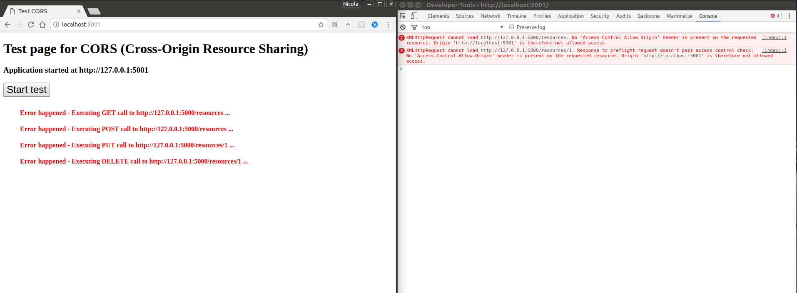
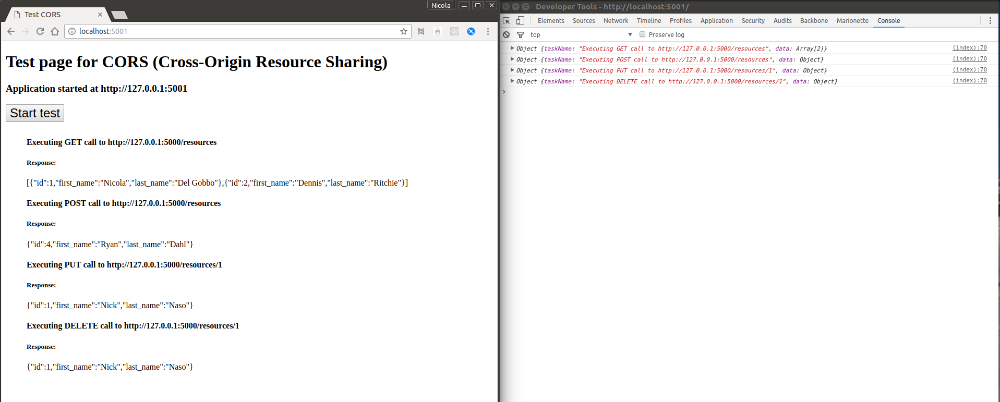

# How to handle CORS (Cross-Origin Resource Sharing) in Express.JS Application

This repository contains all code to handle CORS in [ExpressJS](http://expressjs.com/) Application

Nowadays when we develop web application often we create different web services that will handle our http requests. Those requests may come from different domain or mobile devices. In this case you
need to enable CORS request (Cross-Origin Resource Sharing)

In general if you make a request from web application to a server in different domain and the CORS is not enabled you will get something like this



## For more information about CORS please see the following resources:

[HTTP access control (CORS)](https://developer.mozilla.org/en-US/docs/Web/HTTP/Access_control_CORS)

[Cross-Origin Resource Sharing](https://www.w3.org/TR/cors/)

[Enable CORS](http://enable-cors.org/)

In ExpressJS application you need to use a middleware to make possible CORS requests [https://www.npmjs.com/package/cors](https://www.npmjs.com/package/cors)

In this repo there are two servers one that start on [http://127.0.0.1:5000](http://127.0.0.1:5000) and is the api server and other that start on [http://127.0.0.1:5001](http://127.0.0.1:5001) and serve
simple web application that makes request on the previous server.

## Installation

To install and test the code please follow the following steps:

* Clone or fork the repository
* Go to the local repository folder and digit

```bash
npm install
```

* Once all requested modules have been installed open two different shell screen, point on the project folder and in the first digit

```bash
npm start
```

* In the second shell screen digit

```bash
npm run client
```

Now you can see two different server started now open browser and point to [http://localhost:5001/](http://localhost:5001/) and enjoy the simple web application that test your api server making http reqiest to it.

## Web Application to test CORS request to the API server




I created this repository for all of you have trouble in handle logs in ExpressJS Application.
Feel free to send me feedback and issue to improve the example.

## Nicola Del Gobbo

[https://github.com/NickNaso/](https://github.com/NickNaso/)

[https://www.npmjs.com/~nicknaso](https://www.npmjs.com/~nicknaso)

[https://twitter.com/NickNaso](https://twitter.com/NickNaso)
